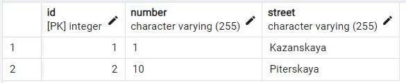

# Hibernate

I will be working with Hibernate and studying its features in this project.

Hibernate is a database management tool that allows us to write entire data models to a database.

The main tasks that I have to complete:

- [x] Explore **Hibernate configuration**
    - Connect Hibernate framework to the project
    - Add
      [hibernate.cfg.xml](https://github.com/ZubovaLE/job4j_hibernate/blob/master/src/main/java/resources/hibernate.cfg.xml)
      file and add required settings to it
- [x] Learn Hibernate Query Language (HQL) (you can find query training in the
  [hql directory](https://github.com/ZubovaLE/job4j_hibernate/tree/master/src/main/java/ru/job4j/hql))
    - learn SELECT queries
    - learn UPDATE queries
    - learn DELETE queries
    - learn INSERT queries
- [x] Consider the ManyToOne
  relationship ([click](https://github.com/ZubovaLE/job4j_hibernate/tree/master/src/main/java/ru/job4j/toone))
- [x] Consider the OneToMany
  relationship ([click](https://github.com/ZubovaLE/job4j_hibernate/tree/master/src/main/java/ru/job4j/oneToMany))
    - consider Unidirectional connection  
      brands table:  
        
      cars table:  
        
      brands_cars table:  
      
- [x] Consider the ManyToMany
  relationship ([click](https://github.com/ZubovaLE/job4j_hibernate/tree/master/src/main/java/ru/job4j/manyToMany))
    - consider Unidirectional connection  
      addresses table:  
        
      persons table:  
        
      persons_addresses table:  
      
- [ ] Consider the LazyInitializationexception 